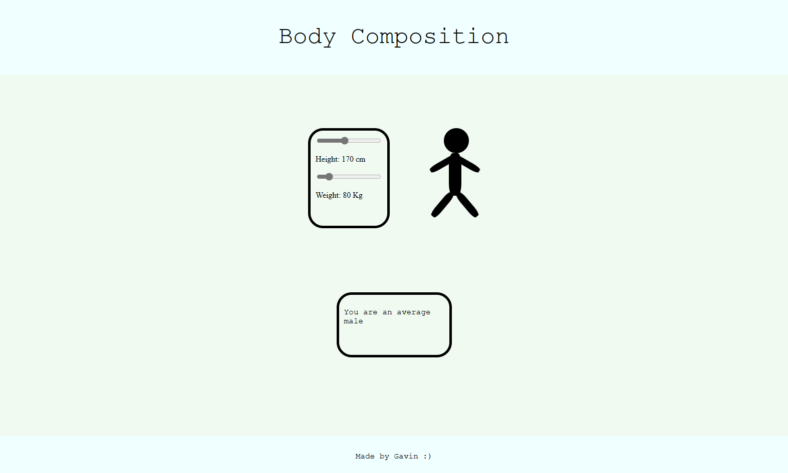

# StickMan App
[Link to Live Demo](https://stick-man.vercel.app/)

## Goals

The goal of this project was to practice DOM manipulation and CSS styling.

## Description

StickMan is a simple web app built with HTML and CSS. Users can interact with the app by dragging sliders to change the height and weight of the stickman. Additionally, there are a few hidden easter eggs waiting to be discovered!
## Features

- Intuitive UI with draggable sliders.
- Real-time updates of StickMan's height and weight.
- Easter eggs for a playful experience.

## Challenges

The biggest challenge was making the stickman size change proportionally to the slider, so that the limbs were connected at the right position.

## Learnings

I was suprised at how reliant the sizing and proportions were on maths

## Built with

 

 

## Screenshots

